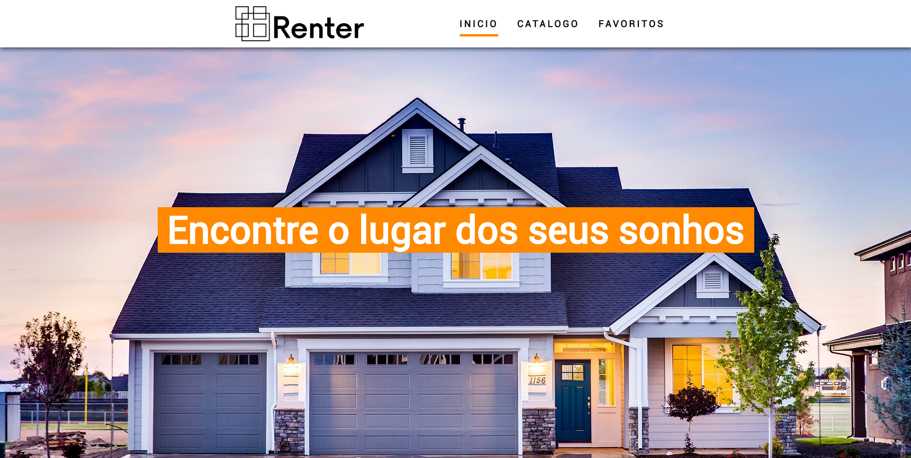
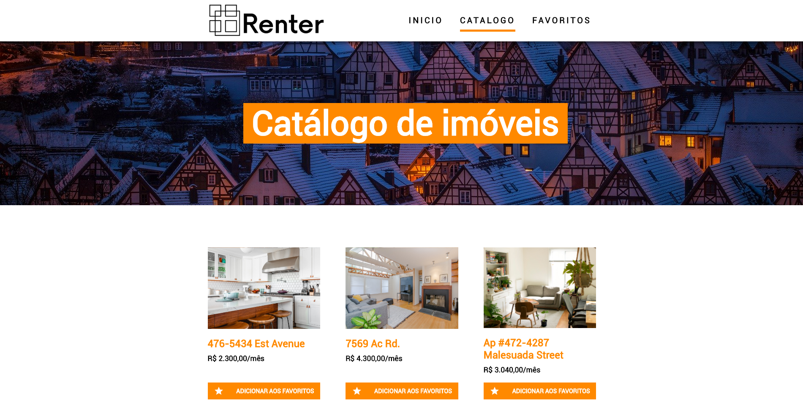

# Renter 🏡

## Rodando o projeto

> Baixe ou clone este repositório.

> Acesse a raiz do projeto por um console e execute:

- `yarn add ou npm i` para instalar as dependências do projeto
- `yarn start ou npm start` para rodar a aplicação

## Imagens: 📷

### <strong>Home:</strong>

### <strong>Catálogo:</strong>

## Sobre o projeto: 📃

Um app que lista imóveis e você pode favoritar os que gostar, o app foi feito com React.js.

## Requisitos do projeto: ✅
* Home - Página com uma saudação.
* Uma tela listando todos esses anúncios.
* Ao clicar em um anúncio, você vai para uma tela com as informações do anúncio, mostrando imagem, titulo, e preço.
* Uma página onde contém os seus imóveis favoritos.

## Frameworks e Tecnologias Utilizadas: 🌌
### Front-End: 🎨

* <strong>React.js</strong> (Criação da Interface)
* <strong>CSS e Styled Components</strong> (Estilização)
* <strong>Redux</strong> (Gerenciamento de estado)
* <strong>Axios</strong> (Requisições a API)
* <strong>AOS</strong> (Animações com o scroll do mouse)
* <strong>ToastfyS</strong> (Notificações na tela)

## Backend: 💾
* <strong>API que lista informações sobre os imóveis</strong>